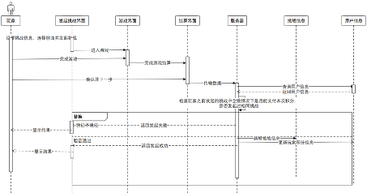

## README.md

- en [English](README.en.md)
- zh_CN [简体中文](readme/README.zh_cn.md)
  
Note: The English version is translated by ChatGPT.

## Core Gameplay

After the game starts, the program loads the corresponding files, and notes will fall on the screen in a specific sequence. When a note reaches the judgement line (the time when the note should be played in the music), the player presses the corresponding key to play the note. After completing several of these actions, the game ends. The program calculates the total score, as well as rewards in terms of coins and experience points based on the player's performance.

The timing diagram for song selection and gameplay is shown below:

### Building the Music Library

The game relies on song files and the corresponding chart files. The chart files should contain the following information: note pitch, timestamp for when the note should be played, note duration, and note volume.

To obtain the original MIDI files, a web crawler is used to crawl a large number of classical music files from the internet. The basic information of these MIDI files is then recorded in a database. The crawled MIDI files are batch processed and transformed into chart files, which are stored in the server file system to build the music library for players to purchase in the virtual store.

### Song Store and Player's Song Assets

The game features a song store system to incentivize players to complete more matches and use the coins earned to purchase and unlock more songs, expanding their song assets. Each song should have the following attributes: song name, author, difficulty, price, download count, and current highest score. Each song in the store should display information such as difficulty, price, and download count. Due to the large number of songs, the store should support search functionality based on song name and author.

Each player has their own song assets. After purchasing a song with coins, it is added to the player's assets. The player's assets record the number of times they played each song and their highest score for each song. The chart file of the song is also stored in the player's local file system and loaded when selecting the song.

Players can only play songs they own. When entering the song selection interface, players can see their highest ranking among all players, their highest score, and the difficulty of the song.

### Initiating Challenges and Responding to Challenges

To enhance gameplay and meet the players' desire for competition with other players, the game introduces a challenge system. When entering the challenge interface from the main menu, players set a base score and multiplier, select a song, and complete a game session. This action initiates a challenge. The system deducts the base score, and the performance in this game session is considered the challenge score. The system uploads the challenge to the server and stores it as an unfinished challenge. Each player can initiate up to 10 challenges simultaneously, and duplicate challenges cannot be initiated. When a player initiates a challenge, the server checks the player's previous unfinished challenges. If all of those challenges were lost and initiating this new challenge would result in a negative score, the challenge is not allowed. It is important to note that players can only select songs they own when initiating challenges, while responders are not required to own the challenging player's song.

Players can also enter the challenge search interface to find all unfinished challenges initiated by other players worldwide. The search function supports searching by author, song name, and challenger. After selecting a challenge, the player responds to the challenge, enters the game interface, completes the same song, and settles the game. The server determines the results and calculates the challenge outcome based on the win or loss, updating the player's score.

## Database Design

Player Information

- Userid: Unique identifier for the user
- Username: User's name
- Level: User's game level
- Goldcoins: Number of coins owned by the user
- Experience: User's experience points
- Scores: User's scores
- Password: Password
- Online: Whether the user is online
  
Song Information

- Name: Song name
- Price: Price
- Difficulty: Difficulty
- Requirelevel: Minimum level required to purchase
- Downloads: Download count
- Author: Song author
- Highestscore: Highest score among all players
  
Player's Song Asset Information

- Songname: Song name
- Userid: User ID
- scoreRecord: Highest score achieved by the user for this song
- playTimes: Number of times the user played this song
  
Game Result Information

- Userid: Unique identifier for the user
- Song: Song name
- Goldcoins: Coins earned in this game session
- Experience: Experience points earned in this game session
- Score: Total score of this game session
- Completetime: Completion time
- Combo: Maximum combo count
- Perfect: Number of perfect judgments
- Great: Number of great judgments
- Good: Number of good judgments
- Miss: Number of miss judgments
  
Challenge Information

- challengeId: Unique identifier for the challenge
- Challenger: ID of the challenger
- Accepter: ID of the respondent
- Ratio: Multiplier value
- Base: Base score value
- ChallengerScore: Total score achieved by the challenger in this game session
- AccepterScore: Total score achieved by the respondent in this game session
- StartTime: Start time of the challenge
- finishTime: Completion time of the challenge
- songName: Song for the challenge
- Completed: Whether the challenge is completed
- Author: Song author
- Completing: Whether the respondent is currently completing the challenge
- challengerName: Username of the challenger
  
Challenge Result Notification Information

- challengeId: Unique identifier for the challenge
- Userid: ID of the user to be notified
- Isread: Whether the notification has been read
### Building the Music Library

Write a web crawler program to crawl over 700 classical music MIDI files from the website https://midi.midicn.com and simultaneously store their song names, authors, and other information in the database.

For MIDI file parsing, use a C++ library that can extract basic note properties and timing information from MIDI files. Batch process the crawled MIDI files and write the start time, duration, corresponding piano key name, and volume of each note into a text file to obtain the chart file.
The resulting chart file is in the following format:

In the chart file, each line represents a single note. Within each line, the first field represents the start time of the note, the second field represents the duration of the note, the third field represents the pitch of the note, and the last field represents the volume of the note.

## System Framework

The entire system adopts a design framework similar to MVC. On the server side, controllers (Controller) and database access objects (DAO) are set up. Certain operations performed on the client side will send requests to the server side and respond to the server's reply.

To exchange structured data between the two ends, it is necessary to use the serialization and deserialization services provided by Protobuf. To use Protobuf, you first need to create a .proto file to define the data structure. In this system, the .proto file is defined in different packages based on functionality, such as LoginPack, SongPack, GameResultPack, etc. These packages are instantiated in MainPack, which stores the main part of the information exchanged between the client and the server.

A part of definition of the .proto file:

When the server hears a request sent by the client, it calls the HandleRequest() method. Based on the value of the RequestCode enumeration, it instantiates different controllers (UserControl, SongControl, GameResultControl, ChallengeControl). It then calls the corresponding method in the controller based on the value of the ActionCode enumeration. Through a series of database storage and retrieval operations provided by the DAO, some of these methods add additional information to the package. Finally, based on the processing result, all methods assign a value to the ReturnCode enumeration to inform the client about the processing result, and send the processed package back to the client. When the client receives the returned package, it calls the HandleResponse() method, instantiates the ResponseProcessor class, and calls its methods to perform different processing based on the value of the ReturnCode enumeration. This implements the communication framework between the client and the server.

### Chart Loading and Simplification

After a player purchases a song, the score content will be transferred to the local device and saved. Each note is abstracted as a Note class, which contains a static hash table of audio files corresponding to each piano note. The score is abstracted as a Sheet class. When a player selects a song, the program calls the ReadSheet() static method in the Sheet class, passing the song name as a parameter. Since songs have inherent temporal features, notes are always presented in sequence. Therefore, in the Sheet class, two static queues (Notes and SimplifiedNotes) are set up. The ReadSheet() method first reads the score file line by line, with each line corresponding to a note. It instantiates a Note and assigns its value, then inserts the initialized Note into the Notes queue. Then, the SheetSimplification() method is called, which is responsible for simplifying the score by combining multiple notes and chords into single notes. The SheetSimplification() method scans the elements in the Notes queue according to the following rules:

Dequeue the element at the front of the queue.
If it is the first element, add it to the tmp array.
If the start time of the element (note) is the same as the previous element, add it to the tmp array again. Repeat steps 1 and 3 until the start time of the element at the front of the queue is different from the previous element.
If the number of elements in the tmp array is 1, directly insert it into the SimplifiedNotes queue.
If the number of elements in the tmp array is 2, insert them into the SimplifiedNotes queue in order.
If the number of elements in the tmp array is greater than 2, call the Skyline() method with the tmp array and the number of elements as parameters, and insert the Note returned by this method into the SimplifiedNotes queue.
Clear the tmp array.
The flowchart of this process is shown in the diagram.

The Skyline() method is a simple melody extraction algorithm that can combine chords into single notes. It selects the note with the highest pitch as the main note and sets the isChord attribute of this note to True.

### Core Gameplay Logic

The control of the game process is mainly handled by two classes, Keyboard.cs and Notes.cs. Keyboard.cs is attached to each piano key and corresponds to different keyboard keys. It is responsible for key operations, note detection, and audio playback. Notes.cs class is responsible for generating notes at specific timings and tracks, as well as handling note destruction.

After the loading of the music score is completed, a timer is started in the background, which is managed by the TimeTable.cs class. It has a static variable called "time" that keeps track of the elapsed time since the start of the gameplay. Each time a game session starts, this timer is reset to zero. This time value is used as an important reference for note generation, note judgment, game over detection, and progress bar updates. Additionally, the ScoreController.CalculateMaxTotalScore() method is invoked to calculate the maximum achievable score for the song.

The ScoreController.cs class handles real-time combo counting and updates during the gameplay, calculates the maximum total score for the song, performs real-time score calculations and updates, and stores the counts for various note judgments such as Perfect, Great, Good, and Miss. At the beginning of each game session, these data are all reset to zero.

Once the countdown displayed at the start of the game reaches zero, the CreateNotes() method in the Notes.cs class checks the start time of the first element in the SimplifiedNotes queue on every frame. If the start time is less than the current "time" from the TimeTable, it immediately generates the note. Depending on the pitch of the note, its corresponding track (horizontal position) is calculated to ensure that it falls directly above the corresponding piano key. In this game, due to the limitations of the keyboard, the same note in different octaves is assigned to the same key. If the "isChord" attribute of the note to be generated is set to True, it will be colored yellow to indicate that it is a synthesized chord note. When such a note is eliminated, multiple audio effects will be played simultaneously to create the effect of a chord.

The created notes appear as GameObjects at the top of the screen and are tagged as "notes". Each note has a unique ID, which is used as its name for the corresponding GameObject. The corresponding Note object is added to the ActiveNotes array, which represents all the notes that have been created but not yet eliminated (i.e., the falling notes on the screen) in an abstract sense. These notes fall at a constant speed.

In Unity, the Update() method is called every frame during the game rendering. To implement the falling effect of the notes, the Update() method in the Notes.cs class retrieves and iterates through all GameObjects tagged with "notes" to update their positions. It also checks the distance by which the notes have surpassed the judgment line to determine if any notes have been missed.

The Update() method in the Keyboard.cs class determines whether the attached piano key has been pressed and displays the corresponding key state. It also determines whether a note can be eliminated.

When a note approaches the judgment line, pressing the corresponding keyboard key requires determining if the note can be eliminated and if the key press is correct. There are generally two methods for this:

Collision detection: This method involves checking for collision between the note and the piano key. It is convenient but resource-intensive, especially in complex scenes or with a large number of operations, which may cause the game to lag.

Time-based calculation: The second method calculates the time difference between the creation of the note and its arrival at the judgment line based on the distance the note has fallen and its falling speed. By comparing this calculated time with the actual time of the key press, it can accurately determine if the note falls within the judgment range.

When the Keyboard.cs class detects a piano key being pressed, it iterates through the elements in the ActiveNotes array. If a note is found to be within the judgment range, it further checks if the pressed key matches the note's intended key press. If it doesn't match, the note is ignored. If it matches, the operation is considered valid for scoring and audio playback. The corresponding audio file is loaded and played once based on the pitch array of the note and the static hash table that maps pitch to audio file names. Then, depending on the difference between the actual key press time and the ideal timing, the game determines whether it was a Perfect, Great, or Good judgment. Finally, the DestroyNotes() method in Notes.cs is called to destroy the note.

The DestroyNotes() method invokes two static methods in ScoreController.cs, CalculateRealTimeScore() and UpdateScore(), to calculate and update the real-time score in the lower left corner of the screen. It also destroys the note and removes it from the ActiveNotes array.

The scoring rules in the game are as follows:

Different note judgments have different base scores: Perfect adds 5 points, Great adds 4 points, Good adds 3 points, and Miss receives no points.
If the combo count during elimination is greater than 10 and less than 30, the base score for that judgment is multiplied by 1.2.
If the combo count during elimination is greater than 30, the base score for that judgment is multiplied by 1.3.
The game's score is represented as a percentage, indicating the current score achieved as a percentage of the maximum achievable score for the song. Since each song has a different maximum score, this representation method better reflects the performance level of the gameplay session.

For counting combos (continuous elimination of notes without missing any), it is only necessary to check for Miss judgments. If a note exceeds a certain threshold beyond the judgment line, it is considered missed, and the combo count is reset to zero. As long as there is no Miss judgment, the combo count increases by one after hitting a note.

Regarding the implementation of the progress bar, there are two methods. The first method is to use the built-in Slider UI control provided by Unity. By changing its value on each frame, the progress bar effect can be achieved. The second method is to create a GameObject representing a rectangular element. Since the length of the progress bar is fixed, the speed at which the slider moves to the right is calculated based on the duration of the song, and its position is updated on each frame. Both methods can be used. In this case, the second method is used.

If the Esc key is pressed during the game, the game session will be immediately terminated, and the game will enter the final scoring phase based on the current game data.

#### Purchasing Songs and Starting the Game

Players can click on the dropdown menu for composer search to retrieve songs by a specific composer, or they can enter the song name themselves for a fuzzy search. Clicking on a song in the list is considered purchasing the song. It sends a request to the server to buy the song, and the server checks the user's coin balance. If there are enough coins, it deducts a certain amount of coins and adds the song to the player's song assets. A purchase success message is then returned to the client.

After a successful purchase, players can enter the song selection interface, which has a similar UI design as the song store. It only displays the songs that the player owns. Players can click on a song to enter the game.

The options in the composer dropdown menu are not preset. Instead, they are initialized by reading the values in the "Author" field from the data packet sent by the server. After the server reads all the specified songs, it also extracts all the different composers and writes them into the "Author" field of the MainPack. Therefore, the content in the dropdown menu varies depending on the transferred songs.

#### Game Settlement
After a game ends or is forcibly interrupted, the game backend packages the specific data of the game and sends it to the server. Then, it enters the game settlement page and waits for the processing result from the server.

Once the server receives the request packet, it calculates the coin reward and experience reward that the player can obtain from this game based on the player's performance in the session, according to a certain rule. The server saves the game result in the database and updates the player's personal data in the database, including the coin balance, total experience points, and level. Afterwards, the server returns the processing result to the client.

Upon receiving the processing result from the server, the client displays the overall score of the game on the screen, as shown in the image.

Players can click on "Retry" to try the song again, but there is only one opportunity during the challenge process, so the retry function cannot be used. After clicking "Continue," players can proceed to the next page.

#### Challenge Module

The current score of the player is displayed in the top-left corner of the interface. Players can use the slider control to set the base score and multiplier value. The current value is dynamically displayed on the right when dragging the slider. After setting the base score and multiplier, clicking on the "Go to Selection" button takes players to the song selection interface. Upon selecting a song, they return to this interface. The selected song and its composer are displayed below, and the "Go to Selection" button changes to a "Change" button. If players want to change the song, they can click on the "Change" button to re-enter the song selection interface, and the changed song will replace the previously selected one. Clicking the "Challenge" button immediately starts the game, and the result of this game session will be recorded as a challenge. After settlement, the server will create an active challenge.

By clicking the "Find Challenges" button in the top-right corner, players can search for all pending challenges initiated by other players:

In addition to searching by composer or song name, this feature also allows searching by player username. Each challenge shows the selected song, challenger's username, challenger's score for this game, the highest historical score achieved by the player for this song, the multiplier and base score set by the challenger. Clicking on a challenge is considered accepting the challenge. It enters the game, completes the session, and proceeds to settlement. During settlement, the server calculates the result of this challenge, updates the user scores for both the challenger and the acceptor, and stores the challenge notification.

The server continuously maintains an array called "ActiveChallenges," which stores all initiated but unfinished challenges. This eliminates the need for frequent database read/write operations. When an acceptor searches for challenges, the server only needs to search for qualifying challenges in this array and return them. When a challenge is completed, the corresponding entry is removed from the ActiveChallenges array and stored in the database. At this point, there will be an empty position in the ActiveChallenges array. To avoid wasting memory by always adding elements to the end of the array, a queue called "freeIndex" is also maintained. When adding an element to the ActiveChallenges array, it first checks if the freeIndex queue is not empty. If not empty, it uses the first available position from the queue and dequeues the front element. When a challenge is completed, the index of that challenge is enqueued into the freeIndex queue. This optimization improves the performance of the server and enhances response speed.

Once players enter the main menu, the game backend continuously sends requests to the server to retrieve challenge results. If there are unread notifications, the server consolidates the information about the challenges and sends it to the client, which displays it on the screen, as shown in the image:

The notification displays the opponent's username, the scores of both parties, and the number of points gained/lost. After being displayed once, the notification is considered read and will not appear again when the player leaves this interface.