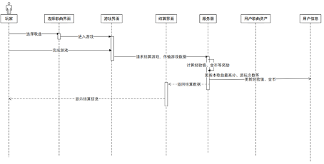
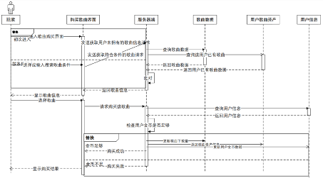
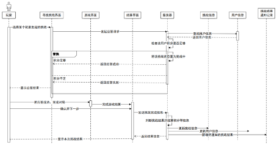
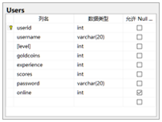
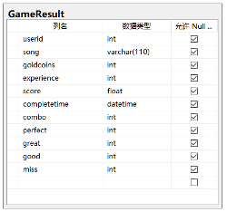
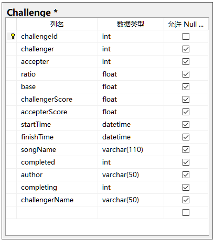
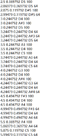
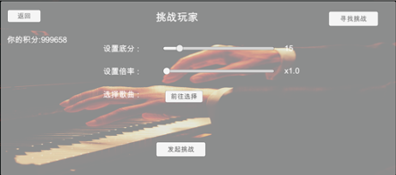
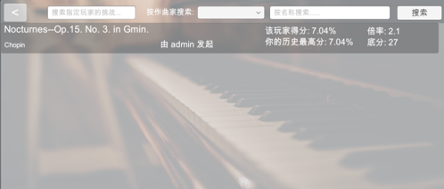

## 核心玩法
在游戏开始后，程序加载对应的文件，屏幕上会以特定的时序下落音符，当音符下落到判定线时(即到了音乐中该音符应被弹奏的时间)，玩家按下与其相对应的恰当的按键，即为完成该音符的弹奏，在完成若干次此类操作后，游戏结束，程序会根据玩家的表现计算总分和金币、经验值奖励。

玩家选择歌曲并完成游戏的时序图如图

### 建立乐曲库
游戏的进行离不开歌曲文件和由此生成的谱面文件。谱面文件应包含以下信息：音符的音高、音符应被弹奏的时间戳、音符的持续时间、音符的音量大小。
对于原MIDI文件的获取，采用爬虫技术爬取网络上的大量古典音乐并将其基本信息录入数据库，对爬取到的MIDI文件批量进行解析和恰当的处理，将其转化为谱面文件，存储到服务器文件系统中，建立曲库以供玩家在虚拟商店中购买。

### 歌曲商店和玩家个人歌曲资产
游戏具有歌曲商店系统以激励玩家来更多地完成对局，使用完成游戏后结算所得的金币来购买并解锁更多的歌曲，扩展自己的歌曲资产。每一首歌曲应包含如下属性：歌曲名称、作者、难度、价格、下载量、当前的最高分。歌曲商店中的每一首歌曲应显示歌曲难度、价格、下载量等信息。由于歌曲量庞大，商店应支持检索功能，可依据歌曲名和作者进行检索。
每一个玩家拥有自己的歌曲资产，玩家使用金币购买歌曲后，歌曲便被添加到该玩家的资产中，它将记录该玩家游玩每一首歌曲的次数、每一首歌曲的最高分，并且歌曲的谱面文件也将存储到玩家本地文件系统，在选择歌曲时从本地加载。
玩家只能弹奏自己所拥有的歌曲，进入歌曲选择界面后，玩家能够看到每一首歌曲自己的最高分在所有玩家中的排名、自己的最高分、歌曲的难度。

### 发起挑战和应答挑战
为提升可玩性，满足玩家在游戏中与其他玩家对抗的需求，游戏引入挑战系统。玩家在主菜单进入挑战界面后，设置底分和倍率，选择歌曲并完成一次游戏后，即为发起了一次挑战，系统扣除底分，此次游戏成绩被视为挑战成绩，系统将此次挑战上传到服务器，服务器将其存储为待完成的挑战。每个玩家最多同时发起10次挑战，不可发起相同的挑战。当玩家每次发起挑战时，服务器会检查该玩家之前发起过的待完成的挑战，若在这些挑战全败的情况下，发起此次挑战若失败后积分会变为负数，则不予发起此次挑战。需要注意的是，玩家发起挑战时只能选择自己所拥有的歌曲，而应答者无需拥有挑战者发起的歌曲即可应答挑战。

玩家也可进入寻找挑战界面，其中将能够找到世界中其他玩家发起的所有待完成的挑战，支持按作者、歌曲名、发起者检索。选择一个挑战后，即认为该玩家应答此挑战，该玩家进入游戏界面，完成相同的歌曲，游戏结算完成后，服务器判定结果，根据胜负结算挑战结果，更新玩家的积分。

## 数据库设计

玩家信息

Userid	用户的唯一标识
Username	用户名
Level	用户的游戏等级
Goldcoins	用户所拥有的金币数
Experience	用户的经验值
Scores	用户的积分
Password	密码
Online	是否在线

歌曲信息

Name	歌曲名
Price	价格
Difficulty	难度
Requirelevel	购买所需等级
Downloads	下载量
Author	歌曲作者
Highestscore	当前所有玩家中的最高分

玩家的歌曲资产信息

Songname	歌曲名
Userid	用户id
scoreRecord	该用户弹奏该歌曲的最高分
playTimes	该用户游玩此歌曲次数

游戏结果信息

Userid	用户的唯一标识id
Song	歌曲名
Goldcoins	此次获得的金币奖励
Experience	此次获得的经验值奖励
Score	此次对局的总分
Completetime	完成时间
Combo	最大连击数
Perfect	Perfect判定数
Great	Great判定数
Good	Good判定数
Miss	Miss判定数

挑战信息

challengeId	挑战的唯一标识id
Challenger	挑战发起者的id
Accepter	应答者的id
Ratio	倍率值
Base	底分值
ChallengerScore	挑战发起者在此次对局中所达到的总分
AccepterScore	挑战应答者在此次对局中所达到的总分
StartTime	此次挑战的发起时间
finishTime	挑战的完成时间
songName	挑战歌曲
Completed	是否已完成
Author	歌曲作者
Completing	应答者是否正在完成
challengerName	挑战发起者的用户名

挑战通知信息

challengeId	挑战唯一的标识id
Userid	需通知的用户id
Isread	是否已读

### 建立曲库
编写爬虫程序爬取网站 https://midi.midicn.com 下的700余首古典音乐MIDI文件并同时将其歌曲名称、作者等信息存储到数据库中。
对于MIDI文件的解析，调用一个可以提取出MIDI文件中音符基本属性和时序信息的C++库，来自https://midifile.sapp.org/ 。对爬取到的MIDI文件批量处理，将每个音符的起始时间、持续时间、对应的钢琴琴键名称、音量大小依次写入文本文件，得到谱面文件。
处理过后得到的谱面文件形式如图

图中，每一行代表一个单独的音符，在每一行中，第一个字段表示音符的起始时间，第二个字段表示音符的持续时间，第三个字段表示音符的音高，最后一个则表示音量的大小。

### 系统框架
整个系统采用类似MVC的设计框架，在服务器端设置控制器(Controller)和数据库访问对象(DAO)，在客户端中进行的部分操作会向服务器端发送请求，对服务器端的回复做出响应。

若要在两端交换结构化的数据，需要借助Protobuf提供的序列化与反序列化服务。要使用Protobuf，首先需要创建.proto文件来定义数据结构，本系统以如图4.3所示的方式定义.proto文件。
其中根据功能划分定义了不同的包，例如LoginPack, SongPack, GameResultPack等等，再将这些包在MainPack中实例化，MainPack中将存储客户端与服务器端交换的信息的主要部分。

.proto文件的部分定义：

当服务器端每次监听到客户端发送来的请求时，会调用HandleRequest()方法，根据枚举类型RequestCode的值实例化不同的Controller(UserControl, SongControl, GameResultControl, ChallengeControl)，再根据枚举类型ActionCode 的值调用Controller中的对应方法，通过调用DAO提供的数据库访问服务，经过一系列对数据库的存储和读取操作，这些方法中有些会将额外的信息加入包中，最后根据处理结果，所有的方法都会对其中的枚举类型ReturnCode赋值以告知客户端此次处理结果如何，将处理过后的包传送回客户端。客户端收到服务器返回的包后调用HandleResponse()方法，并实例化ResponseProcessor类，调用其中的方法，根据ReturnCode的值做出不同的处理，由此实现了客户端与服务器端的通信框架。

### 曲谱的加载和简化
玩家在购买歌曲后，曲谱内容会传输到本地并保存。每一个音符被抽象为Note类，Note类中包含每一个钢琴音符所对应的音频文件的静态哈希表，曲谱被抽象为Sheet类，当玩家选择好歌曲时，程序调用Sheet类中的ReadSheet()静态方法，传入的参数为歌曲名称。由于歌曲所拥有的天然的时序特性，音符一定是按序出现的，因此在Sheet类中设置两个静态队列(Queue)：Notes和SimplifiedNotes，ReadSheet()方法首先将逐行读取曲谱文件，每一行即对应一个音符，实例化Note并对其赋值，将初始化后的Note插入Notes队列。随后将调用SheetSimplification()方法，该方法负责曲谱的简化，即将多个音符和弦合成为单个音符。SheetSimplification()会依照如下规则扫描Notes队列中的元素：
1.	队头元素出队；
2.	若为第一个元素，将其置入tmp数组；
3.	若元素(音符)的起始时间与上一个元素相同，再次将其置入tmp数组，重复1，3过程直至队头元素的起始时间与上一个元素不同；
4.	若tmp数组中元素个数为1，直接插入SimplifiedNotes队列；
5.	若tmp数组中元素个数为2，按序直接插入SimplifiedNotes队列；
6.	若tmp数组中元素个数大于2，调用Skyline()方法，传入的参数为tmp数组和数组元素个数，将此方法返回的Note插入SimplifiedNotes队列；
7.	将tmp数组清空。
此流程的示意图如图所示。

Skyline()方法是一种简单的旋律提取算法，可以将和弦合成为单个音符，它将选取音高最高的音符作为主音符，并将此音符的isChord属性记为True。

### 游戏核心逻辑
游戏过程的控制主要由Keyboard.cs和Notes.cs两个类完成。Keyboard.cs将被挂载到每一个钢琴琴键上，其对应不同的键盘按键，负责琴键的操作响应、音符操作判定以及音频文件的播放工作。Notes.cs类将负责音符应在何时、哪一轨道生成，以及音符的销毁工作。
在曲谱的加载工作完成后，后台将开启计时器，由 TimeTable.cs 类负责，它有一个静态变量time，它将在每一帧更新自开始对局之时起已经过的时间(即time)，每一次对局开始时，该时间都会被清零。这一时间将被用作创建音符和判定音符消除的重要依据。它还将负责游戏结束的判定和界面上方进度条的更新。与此同时，ScoreController.CalculateMaxTotalScore()方法也将被调用，它将计算出此乐曲所能达到的最高分数。
ScoreController.cs将负责游戏过程中的实时Combo计数和更新，歌曲最大总分的计算，实时的分数计算和更新，以及存储各类音符判定的计数，如Perfect,Great,Good,Miss的计数。在每一次对局开始时，这些数据均会被清零。
在游戏开始时显示的倒计时结束后，Notes.cs类中的CreateNotes()方法将在每一帧检查SimplifiedNotes队列的队头元素音符的起始时间，若小于TimeTable中的时间time，则立即生成该音符，根据音符的音高，计算音符所在的轨道(即生成位置的横坐标)以确保它将落在对应琴键的正上方，在本游戏中，由于键盘的局限性，不同八度下相同音级的音符会由同一个按键所负责。若将要生成的音符的isChord属性为True，则生成时会将其颜色设置为黄色，以表明它是经过合成的和弦音符，消除时将会同时播放多个音频音效以形成和弦的效果。
创建完成的音符会作为游戏的GameObject出现在屏幕的最上方，被添加“notes”标签(tag)，每一个音符具有唯一的ID，它将作为此GameObject的名称，对应的Note会被加入到ActiveNotes数组中。ActiveNotes数组将抽象地代表所有已创建但未被消除的音符，即屏幕上存在的正在下落的音符(但是并非GameObject实体)。这些音符会以一定的速度匀速落下。
在Unity中，Update()方法将在游戏每一帧渲染时调用。为了实现音符的下落，Notes.cs类中的Update()方法会获取并遍历所有带有“notes”标签的GameObject以更新音符的位置，同时也会检测音符超过判定线的距离来判断音符是否有遗漏(Miss)。
Keyboard.cs类中的Update()方法会判断它所挂载的琴键是否被按下，从而显示不同的琴键状态和判断是否可以消除音符。
当音符落到判定线附近时，若按下键盘按键，此时需要判断音符是否可以消除以及按键是否正确。此时一般有两种方法：
第一种方法是使用碰撞检测。这种方法的优势在于它十分便利，只需判断音符和琴键是否有碰撞即可。但这种方法的缺点也很明显：对于碰撞的检测非常消耗系统资源，面对复杂的场景和大量的操作时可能会造成游戏卡顿。
因此这里采用第二种方法，我们只需要根据音符的下落距离和下落速度，计算出音符从被创建到落到判定线之间的时间差，结合音符的创建时间，即可准确判断按下按键时音符是否在判定范围。
当Keyboard.cs类检测到自己所挂载的琴键被按下时，将遍历ActiveNotes数组中的元素。若发现音符进入判定范围，则会再进一步判断该音符的按键是否正确，若不正确，则将其忽略，若正确，说明此次操作可被计分、可以播放音频，因此先根据音符中的pitch数组以及Note.cs中的音高-音频文件名的静态哈希表加载所有的音频文件并播放一次。然后继续根据按下的时间与应被按下的时间之差的大小判断此次操作是Perfect、Great还是Good，再调用Notes.cs中的DestroyNotes()方法来销毁音符。
Notes.DestroyNotes()方法会调用ScoreController.cs中的两个静态方法CalculateRealTimeScore()和UpdateScore()，计算并在画面的左下角更新实时分数，销毁音符并在ActiveNotes中去除此Note。
本游戏对于分数的计算规则如下：
1.	不同的音符消除判定有不同的基准分，其中一次Perfect判定加5分，Great加4分，Good加3分，Miss判定不得分；
2.	若消除时的Combo数大于10且小于30，则这一次判定的基准分变为1.2倍；
3.	若消除时的Combo数大于30，则这一次判定的基准分变为1.3倍。
游戏的分数以百分比数字表示，它代表当前获得的分值占此歌曲所能达到的最高分数的百分比。由于每首歌曲所能达到的最高分不相同，这种分数表示方法能够更好地表明此次对局的表现水平如何。
对于游戏中Combo(不遗漏地连续消除音符的数量)的计数，只需检测是否有Miss判定，而若要检测Miss判定，则只需在每一帧检测屏幕上的所有音符超出判定线的距离，若超过一个阈值，则判定此音符被遗漏(即Miss)，此时Combo计数会清零。因此只要没有检测到Miss判定，在命中一个音符后，Combo计数便加一即可。
对于上方进度条的实现，此处有两种方法，第一种为使用Unity引擎自带的UI控件Slider，在每一帧改变它的值，即可实现进度条的效果。第二种方法为创建一个GameObject方块元素，由于进度条长度是固定的，只需根据歌曲时长计算滑块向右移动的速度，每一帧更新其位置即可。使用这两种方法均可。这里使用了第二种方法。
若在游戏中按下Esc键，则会立即强制终止游戏对局，根据此时的游戏数据，直接进入结算。

#### 购买歌曲并开始游戏

玩家可以点击按作曲家搜索的下拉菜单检索指定作曲家的歌曲，也可以自行输入歌曲名来进行模糊搜索。点击列表中的歌曲即视为购买此歌曲，向服务器发送购买歌曲请求，服务器会检查用户金币余额，若充足则扣除若干金币，将此歌曲加入玩家的歌曲资产，向客户端返回购买成功信息。
购买成功后，玩家即可进入选择歌曲界面，其UI设计语言与歌曲商店类似，其中只展示玩家所拥有的歌曲。玩家点击歌曲后即可进入游戏。
下拉菜单中的作者选项并不是预设的，而是通过读取服务器端传来的数据包中的Author字段中的值来初始化的。服务器端在读取出所有指定的歌曲后，也会提取出所有不同的作曲家，将其写入MainPack的Author字段。因此传输的歌曲不同，下拉菜单中的内容也会不同。

#### 游戏结算
当游戏结束后或强制中断结束后，游戏后台将打包此次游戏的具体数据，并将其发送给服务器端，进入游戏结算页面，等待服务器端返回的处理结果。
服务器端收到请求包后会根据玩家在此次对局中的表现，以一种规则计算此次对局所能获得的金币奖励和经验值奖励，将此次游戏结果存入数据库后，服务器也会同时更新数据库中玩家个人数据中的金币数和经验值总量和等级，之后会向客户端返回处理结果。
客户端在收到服务器返回的处理结果后会在屏幕上显示此次游戏的综合成绩，如图所示。

玩家可点击“重试”来再一次尝试此歌曲，但在进行挑战的过程中，只有一次机会，因此无法使用重试功能。玩家点击“继续”后，可进入下一页面。

#### 挑战模块

界面的左上角会展示玩家当前的积分数量。玩家可以通过Slider控件来设置底分和倍率的值，在拖动滑块时右边会实时显示当前值。在设置好底分和倍率后，点击“前往选择”按钮即可进入歌曲选择界面。选择好歌曲后就会返回此界面，下方会显示选择的歌曲和歌曲的作者，同时，“前往选择”按钮会变为“更改”按钮，玩家若想更换歌曲，点击更换按钮即可再次进入选择歌曲界面，更改的歌曲会覆盖之前选择的歌曲，点击发起挑战按钮即可立即开始游戏，此次游戏成绩将作为挑战的成绩，在结算过后，服务器端会创建一个待完成的挑战。
玩家点击右上角的寻找挑战按钮，即可搜索到所有玩家发起的所有待完成的挑战：

此处在支持按作曲家搜索和按歌曲名搜索的基础上，额外增加了按玩家用户名搜索的功能。在每一个挑战中，会显示挑战者所选择的歌曲、挑战者的用户名、挑战者此次游戏的成绩和本玩家游玩此歌曲所获得的历史最高成绩、挑战者设置的倍率和底分，点击其中一个挑战后即视为应答此挑战，进入游戏并完成对局后进入结算，服务器在结算时也会同时结算此次挑战的结果，更新挑战者和应答者的用户积分，存储挑战通知。
服务器端会实时地维护一个数组ActiveChallenges，它存储所有已发起但未完成的挑战，这样就无需再频繁地对数据库进行存取操作，应答者搜索挑战时服务器只需从此数组中搜索符合条件的挑战并返回即可，当一个挑战被完成时，ActiveChallenges数组将删除此挑战，并将信息存入数据库。而此时ActiveChallenges数组将会空出一个元素位置，若每次都从数组末尾添加元素，长时间运行后会造成内存空间的浪费，因此这里再维护一个队列freeIndex来存储所有空出来的元素位置下标，当向ActiveChallenges数组中添加元素时，会首先检查freeIndex队头是否为空，若不空，则优先使用空闲出来的位置来放置新的元素，此时freeIndex队头元素出队；当一个挑战被完成时，freeIndex队列会将此元素的下标入队。如此便优化了服务器端的性能，提高了响应速度。
玩家在进入主菜单后，游戏后台会持续向服务器发送获取挑战结果的请求。若存在未读的通知，服务器会将未读通知的挑战信息整合后发送给客户端并显示在屏幕上，效果如图所示：

在通知中，将显示对手的用户名，双方得分情况，以及获得/损失的积分数量。在显示一次后，即视为已读，离开此界面后不会再显示。
